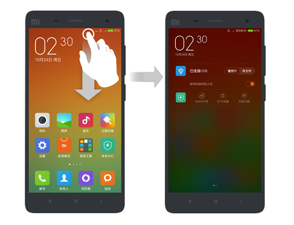
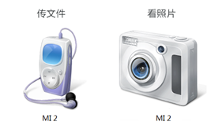

# MIUI-6-CD-ROM.iso
Extracted CD-ROM files from MIUI 6 source code 
<html xmlns:v="urn:schemas-microsoft-com:vml"
xmlns:o="urn:schemas-microsoft-com:office:office"
xmlns:w="urn:schemas-microsoft-com:office:word"
xmlns:m="http://schemas.microsoft.com/office/2004/12/omml"
xmlns="http://www.w3.org/TR/REC-html40" xmlns:ns0="http://macVmlSchemaUri">

<head>
<meta http-equiv=Content-Type content="text/html; charset=windows-1252">
<meta name=ProgId content=Word.Document>
<meta name=Generator content="Microsoft Word 14">
<meta name=Originator content="Microsoft Word 14">
<link rel=File-List href="Readme_files/filelist.xml">
<link rel=Edit-Time-Data href="Readme_files/editdata.mso">
<!--[if !mso]>

<![endif]--><!--[if gte mso 9]><xml>
 <o:DocumentProperties>
  <o:Author>Abby Phang</o:Author>
  <o:Template>Normal</o:Template>
  <o:LastAuthor>wangteng</o:LastAuthor>
  <o:Revision>2</o:Revision>
  <o:TotalTime>4</o:TotalTime>
  <o:Created>2014-11-14T07:28:00Z</o:Created>
  <o:LastSaved>2014-11-14T07:28:00Z</o:LastSaved>
  <o:Pages>1</o:Pages>
  <o:Words>71</o:Words>
  <o:Characters>407</o:Characters>
  <o:Company>Xiaomi</o:Company>
  <o:Lines>3</o:Lines>
  <o:Paragraphs>1</o:Paragraphs>
  <o:CharactersWithSpaces>477</o:CharactersWithSpaces>
  <o:Version>14.00</o:Version>
 </o:DocumentProperties>
 <o:OfficeDocumentSettings>
  <o:AllowPNG/>
 </o:OfficeDocumentSettings>
</xml><![endif]-->
<link rel=themeData href="Readme_files/themedata.thmx">
<link rel=colorSchemeMapping href="Readme_files/colorschememapping.xml">
<!--[if gte mso 9]><xml>
 <w:WordDocument>
  <w:SpellingState>Clean</w:SpellingState>
  <w:GrammarState>Clean</w:GrammarState>
  <w:TrackMoves>false</w:TrackMoves>
  <w:TrackFormatting/>
  <w:AutoHyphenation/>
  <w:DrawingGridHorizontalSpacing>0 &#30917;</w:DrawingGridHorizontalSpacing>
  <w:DrawingGridVerticalSpacing>0 &#30917;</w:DrawingGridVerticalSpacing>
  <w:DisplayHorizontalDrawingGridEvery>0</w:DisplayHorizontalDrawingGridEvery>
  <w:DisplayVerticalDrawingGridEvery>0</w:DisplayVerticalDrawingGridEvery>
  <w:UseMarginsForDrawingGridOrigin/>
  <w:ValidateAgainstSchemas>false</w:ValidateAgainstSchemas>
  <w:SaveIfXMLInvalid>false</w:SaveIfXMLInvalid>
  <w:IgnoreMixedContent>false</w:IgnoreMixedContent>
  <w:AlwaysShowPlaceholderText>false</w:AlwaysShowPlaceholderText>
  <w:DoNotUnderlineInvalidXML/>
  <w:DoNotPromoteQF/>
  <w:LidThemeOther>EN-US</w:LidThemeOther>
  <w:LidThemeAsian>JA</w:LidThemeAsian>
  <w:LidThemeComplexScript>X-NONE</w:LidThemeComplexScript>
  <w:DrawingGridHorizontalOrigin>0 &#30917;</w:DrawingGridHorizontalOrigin>
  <w:DrawingGridVerticalOrigin>0 &#30917;</w:DrawingGridVerticalOrigin>
  <w:DoNotShadeFormData/>
  <w:Compatibility>
   <w:SpaceForUL/>
   <w:BalanceSingleByteDoubleByteWidth/>
   <w:DoNotLeaveBackslashAlone/>
   <w:ULTrailSpace/>
   <w:DoNotExpandShiftReturn/>
   <w:AdjustLineHeightInTable/>
   <w:BreakWrappedTables/>
   <w:SnapToGridInCell/>
   <w:WrapTextWithPunct/>
   <w:UseAsianBreakRules/>
   <w:DontGrowAutofit/>
   <w:SplitPgBreakAndParaMark/>
   <w:UseFELayout/>
  </w:Compatibility>
  <w:BrowserLevel>MicrosoftInternetExplorer4</w:BrowserLevel>
  <m:mathPr>
   <m:mathFont m:val="Cambria Math"/>
   <m:brkBin m:val="before"/>
   <m:brkBinSub m:val="&#45;-"/>
   <m:smallFrac m:val="off"/>
   <m:dispDef/>
   <m:lMargin m:val="0"/>
   <m:rMargin m:val="0"/>
   <m:defJc m:val="centerGroup"/>
   <m:wrapIndent m:val="1440"/>
   <m:intLim m:val="subSup"/>
   <m:naryLim m:val="undOvr"/>
  </m:mathPr></w:WordDocument>
</xml><![endif]--><!--[if gte mso 9]><xml>
 <w:LatentStyles DefLockedState="true" DefUnhideWhenUsed="false"
  DefSemiHidden="false" DefQFormat="false" LatentStyleCount="267">
  <w:LsdException Locked="true" QFormat="true" Name="Normal"/>
  <w:LsdException Locked="true" QFormat="true" Name="heading 1"/>
  <w:LsdException Locked="true" SemiHidden="true" UnhideWhenUsed="true"
   QFormat="true" Name="heading 2"/>
  <w:LsdException Locked="true" SemiHidden="true" UnhideWhenUsed="true"
   QFormat="true" Name="heading 3"/>
  <w:LsdException Locked="true" SemiHidden="true" UnhideWhenUsed="true"
   QFormat="true" Name="heading 4"/>
  <w:LsdException Locked="true" SemiHidden="true" UnhideWhenUsed="true"
   QFormat="true" Name="heading 5"/>
  <w:LsdException Locked="true" SemiHidden="true" UnhideWhenUsed="true"
   QFormat="true" Name="heading 6"/>
  <w:LsdException Locked="true" SemiHidden="true" UnhideWhenUsed="true"
   QFormat="true" Name="heading 7"/>
  <w:LsdException Locked="true" SemiHidden="true" UnhideWhenUsed="true"
   QFormat="true" Name="heading 8"/>
  <w:LsdException Locked="true" SemiHidden="true" UnhideWhenUsed="true"
   QFormat="true" Name="heading 9"/>
  <w:LsdException Locked="true" SemiHidden="true" UnhideWhenUsed="true"
   QFormat="true" Name="caption"/>
  <w:LsdException Locked="true" QFormat="true" Name="Title"/>
  <w:LsdException Locked="true" Priority="1" Name="Default Paragraph Font"/>
  <w:LsdException Locked="true" QFormat="true" Name="Subtitle"/>
  <w:LsdException Locked="true" QFormat="true" Name="Strong"/>
  <w:LsdException Locked="true" QFormat="true" Name="Emphasis"/>
  <w:LsdException Locked="true" Priority="99" Name="No List"/>
  <w:LsdException Locked="false" Priority="99" SemiHidden="true"
   Name="Placeholder Text"/>
  <w:LsdException Locked="false" Priority="1" QFormat="true" Name="No Spacing"/>
  <w:LsdException Locked="false" Priority="60" Name="Light Shading"/>
  <w:LsdException Locked="false" Priority="61" Name="Light List"/>
  <w:LsdException Locked="false" Priority="62" Name="Light Grid"/>
  <w:LsdException Locked="false" Priority="63" Name="Medium Shading 1"/>
  <w:LsdException Locked="false" Priority="64" Name="Medium Shading 2"/>
  <w:LsdException Locked="false" Priority="65" Name="Medium List 1"/>
  <w:LsdException Locked="false" Priority="66" Name="Medium List 2"/>
  <w:LsdException Locked="false" Priority="67" Name="Medium Grid 1"/>
  <w:LsdException Locked="false" Priority="68" Name="Medium Grid 2"/>
  <w:LsdException Locked="false" Priority="69" Name="Medium Grid 3"/>
  <w:LsdException Locked="false" Priority="70" Name="Dark List"/>
  <w:LsdException Locked="false" Priority="71" Name="Colorful Shading"/>
  <w:LsdException Locked="false" Priority="72" Name="Colorful List"/>
  <w:LsdException Locked="false" Priority="73" Name="Colorful Grid"/>
  <w:LsdException Locked="false" Priority="60" Name="Light Shading Accent 1"/>
  <w:LsdException Locked="false" Priority="61" Name="Light List Accent 1"/>
  <w:LsdException Locked="false" Priority="62" Name="Light Grid Accent 1"/>
  <w:LsdException Locked="false" Priority="63" Name="Medium Shading 1 Accent 1"/>
  <w:LsdException Locked="false" Priority="64" Name="Medium Shading 2 Accent 1"/>
  <w:LsdException Locked="false" Priority="65" Name="Medium List 1 Accent 1"/>
  <w:LsdException Locked="false" Priority="99" SemiHidden="true" Name="Revision"/>
  <w:LsdException Locked="false" Priority="34" QFormat="true"
   Name="List Paragraph"/>
  <w:LsdException Locked="false" Priority="29" QFormat="true" Name="Quote"/>
  <w:LsdException Locked="false" Priority="30" QFormat="true"
   Name="Intense Quote"/>
  <w:LsdException Locked="false" Priority="66" Name="Medium List 2 Accent 1"/>
  <w:LsdException Locked="false" Priority="67" Name="Medium Grid 1 Accent 1"/>
  <w:LsdException Locked="false" Priority="68" Name="Medium Grid 2 Accent 1"/>
  <w:LsdException Locked="false" Priority="69" Name="Medium Grid 3 Accent 1"/>
  <w:LsdException Locked="false" Priority="70" Name="Dark List Accent 1"/>
  <w:LsdException Locked="false" Priority="71" Name="Colorful Shading Accent 1"/>
  <w:LsdException Locked="false" Priority="72" Name="Colorful List Accent 1"/>
  <w:LsdException Locked="false" Priority="73" Name="Colorful Grid Accent 1"/>
  <w:LsdException Locked="false" Priority="60" Name="Light Shading Accent 2"/>
  <w:LsdException Locked="false" Priority="61" Name="Light List Accent 2"/>
  <w:LsdException Locked="false" Priority="62" Name="Light Grid Accent 2"/>
  <w:LsdException Locked="false" Priority="63" Name="Medium Shading 1 Accent 2"/>
  <w:LsdException Locked="false" Priority="64" Name="Medium Shading 2 Accent 2"/>
  <w:LsdException Locked="false" Priority="65" Name="Medium List 1 Accent 2"/>
  <w:LsdException Locked="false" Priority="66" Name="Medium List 2 Accent 2"/>
  <w:LsdException Locked="false" Priority="67" Name="Medium Grid 1 Accent 2"/>
  <w:LsdException Locked="false" Priority="68" Name="Medium Grid 2 Accent 2"/>
  <w:LsdException Locked="false" Priority="69" Name="Medium Grid 3 Accent 2"/>
  <w:LsdException Locked="false" Priority="70" Name="Dark List Accent 2"/>
  <w:LsdException Locked="false" Priority="71" Name="Colorful Shading Accent 2"/>
  <w:LsdException Locked="false" Priority="72" Name="Colorful List Accent 2"/>
  <w:LsdException Locked="false" Priority="73" Name="Colorful Grid Accent 2"/>
  <w:LsdException Locked="false" Priority="60" Name="Light Shading Accent 3"/>
  <w:LsdException Locked="false" Priority="61" Name="Light List Accent 3"/>
  <w:LsdException Locked="false" Priority="62" Name="Light Grid Accent 3"/>
  <w:LsdException Locked="false" Priority="63" Name="Medium Shading 1 Accent 3"/>
  <w:LsdException Locked="false" Priority="64" Name="Medium Shading 2 Accent 3"/>
  <w:LsdException Locked="false" Priority="65" Name="Medium List 1 Accent 3"/>
  <w:LsdException Locked="false" Priority="66" Name="Medium List 2 Accent 3"/>
  <w:LsdException Locked="false" Priority="67" Name="Medium Grid 1 Accent 3"/>
  <w:LsdException Locked="false" Priority="68" Name="Medium Grid 2 Accent 3"/>
  <w:LsdException Locked="false" Priority="69" Name="Medium Grid 3 Accent 3"/>
  <w:LsdException Locked="false" Priority="70" Name="Dark List Accent 3"/>
  <w:LsdException Locked="false" Priority="71" Name="Colorful Shading Accent 3"/>
  <w:LsdException Locked="false" Priority="72" Name="Colorful List Accent 3"/>
  <w:LsdException Locked="false" Priority="73" Name="Colorful Grid Accent 3"/>
  <w:LsdException Locked="false" Priority="60" Name="Light Shading Accent 4"/>
  <w:LsdException Locked="false" Priority="61" Name="Light List Accent 4"/>
  <w:LsdException Locked="false" Priority="62" Name="Light Grid Accent 4"/>
  <w:LsdException Locked="false" Priority="63" Name="Medium Shading 1 Accent 4"/>
  <w:LsdException Locked="false" Priority="64" Name="Medium Shading 2 Accent 4"/>
  <w:LsdException Locked="false" Priority="65" Name="Medium List 1 Accent 4"/>
  <w:LsdException Locked="false" Priority="66" Name="Medium List 2 Accent 4"/>
  <w:LsdException Locked="false" Priority="67" Name="Medium Grid 1 Accent 4"/>
  <w:LsdException Locked="false" Priority="68" Name="Medium Grid 2 Accent 4"/>
  <w:LsdException Locked="false" Priority="69" Name="Medium Grid 3 Accent 4"/>
  <w:LsdException Locked="false" Priority="70" Name="Dark List Accent 4"/>
  <w:LsdException Locked="false" Priority="71" Name="Colorful Shading Accent 4"/>
  <w:LsdException Locked="false" Priority="72" Name="Colorful List Accent 4"/>
  <w:LsdException Locked="false" Priority="73" Name="Colorful Grid Accent 4"/>
  <w:LsdException Locked="false" Priority="60" Name="Light Shading Accent 5"/>
  <w:LsdException Locked="false" Priority="61" Name="Light List Accent 5"/>
  <w:LsdException Locked="false" Priority="62" Name="Light Grid Accent 5"/>
  <w:LsdException Locked="false" Priority="63" Name="Medium Shading 1 Accent 5"/>
  <w:LsdException Locked="false" Priority="64" Name="Medium Shading 2 Accent 5"/>
  <w:LsdException Locked="false" Priority="65" Name="Medium List 1 Accent 5"/>
  <w:LsdException Locked="false" Priority="66" Name="Medium List 2 Accent 5"/>
  <w:LsdException Locked="false" Priority="67" Name="Medium Grid 1 Accent 5"/>
  <w:LsdException Locked="false" Priority="68" Name="Medium Grid 2 Accent 5"/>
  <w:LsdException Locked="false" Priority="69" Name="Medium Grid 3 Accent 5"/>
  <w:LsdException Locked="false" Priority="70" Name="Dark List Accent 5"/>
  <w:LsdException Locked="false" Priority="71" Name="Colorful Shading Accent 5"/>
  <w:LsdException Locked="false" Priority="72" Name="Colorful List Accent 5"/>
  <w:LsdException Locked="false" Priority="73" Name="Colorful Grid Accent 5"/>
  <w:LsdException Locked="false" Priority="60" Name="Light Shading Accent 6"/>
  <w:LsdException Locked="false" Priority="61" Name="Light List Accent 6"/>
  <w:LsdException Locked="false" Priority="62" Name="Light Grid Accent 6"/>
  <w:LsdException Locked="false" Priority="63" Name="Medium Shading 1 Accent 6"/>
  <w:LsdException Locked="false" Priority="64" Name="Medium Shading 2 Accent 6"/>
  <w:LsdException Locked="false" Priority="65" Name="Medium List 1 Accent 6"/>
  <w:LsdException Locked="false" Priority="66" Name="Medium List 2 Accent 6"/>
  <w:LsdException Locked="false" Priority="67" Name="Medium Grid 1 Accent 6"/>
  <w:LsdException Locked="false" Priority="68" Name="Medium Grid 2 Accent 6"/>
  <w:LsdException Locked="false" Priority="69" Name="Medium Grid 3 Accent 6"/>
  <w:LsdException Locked="false" Priority="70" Name="Dark List Accent 6"/>
  <w:LsdException Locked="false" Priority="71" Name="Colorful Shading Accent 6"/>
  <w:LsdException Locked="false" Priority="72" Name="Colorful List Accent 6"/>
  <w:LsdException Locked="false" Priority="73" Name="Colorful Grid Accent 6"/>
  <w:LsdException Locked="false" Priority="19" QFormat="true"
   Name="Subtle Emphasis"/>
  <w:LsdException Locked="false" Priority="21" QFormat="true"
   Name="Intense Emphasis"/>
  <w:LsdException Locked="false" Priority="31" QFormat="true"
   Name="Subtle Reference"/>
  <w:LsdException Locked="false" Priority="32" QFormat="true"
   Name="Intense Reference"/>
  <w:LsdException Locked="false" Priority="33" QFormat="true" Name="Book Title"/>
  <w:LsdException Locked="false" Priority="37" SemiHidden="true"
   UnhideWhenUsed="true" Name="Bibliography"/>
  <w:LsdException Locked="false" Priority="39" SemiHidden="true"
   UnhideWhenUsed="true" QFormat="true" Name="TOC Heading"/>
 </w:LatentStyles>
</xml><![endif]-->

<!--[if gte mso 10]>

<![endif]-->
<meta name=Title content="">
<meta name=Keywords content="">
<!--[if gte mso 9]><xml>
 <o:shapedefaults v:ext="edit" spidmax="1026"/>
</xml><![endif]--><!--[if gte mso 9]><xml>
 <o:shapelayout v:ext="edit">
  <o:idmap v:ext="edit" data="1"/>
 </o:shapelayout></xml><![endif]-->
</head>

<body lang=ZH-CN style='tab-interval:36.0pt'>

&#27426;&#36814;&#65292;&#24744;&#27491;&#35775;&#38382;&#23567;&#31859;&#25163;&#26426;&#24037;&#20855;&#30446;&#24405;<o:p></o:p>

<o:p>&nbsp;</o:p>

&#35201;&#20351;&#29992;&#30005;&#33041;&#35775;&#38382;&#25163;&#26426;&#25991;&#20214;&#25110;&#29031;&#29255;&#65292;&#35831;&#22312;&#25163;&#26426;&#19978;&#20999;&#25442;&#36830;&#25509;&#27169;&#24335;&#12290;<o:p></o:p>

<![if !supportLists]>�&nbsp;&nbsp;&nbsp;&nbsp;&nbsp;
<![endif]>&#22914;&#26524;&#36830;&#25509;&#25163;&#26426;&#25104;&#21151;&#65292;&#20250;&#22312;&#30005;&#33041;&#19978;&#30475;&#21040;&#21517;&#20026;MI X&#30340;&#20415;&#25658;&#35774;&#22791;&#65307;<o:p></o:p>

<!--[if gte vml 1]><v:shapetype id="_x0000_t75" coordsize="21600,21600"
 o:spt="75" o:preferrelative="t" path="m@4@5l@4@11@9@11@9@5xe" filled="f"
 stroked="f">
 <v:stroke joinstyle="miter"/>
 <v:formulas>
  <v:f eqn="if lineDrawn pixelLineWidth 0"/>
  <v:f eqn="sum @0 1 0"/>
  <v:f eqn="sum 0 0 @1"/>
  <v:f eqn="prod @2 1 2"/>
  <v:f eqn="prod @3 21600 pixelWidth"/>
  <v:f eqn="prod @3 21600 pixelHeight"/>
  <v:f eqn="sum @0 0 1"/>
  <v:f eqn="prod @6 1 2"/>
  <v:f eqn="prod @7 21600 pixelWidth"/>
  <v:f eqn="sum @8 21600 0"/>
  <v:f eqn="prod @7 21600 pixelHeight"/>
  <v:f eqn="sum @10 21600 0"/>
 </v:formulas>
 <v:path o:extrusionok="f" gradientshapeok="t" o:connecttype="rect"/>
 <o:lock v:ext="edit" aspectratio="t"/>
</v:shapetype><v:shape id="_x0000_i1028" type="#_x0000_t75" alt="B0B39940C0CB1E289FF2284C79AB0638"
 style='width:436.5pt;height:333.75pt;visibility:visible;mso-wrap-style:square'>
 <v:imagedata src="Readme_files/image001.png" o:title="B0B39940C0CB1E289FF2284C79AB0638"/>
</v:shape><![endif]--><![if !vml]><![endif]><o:p></o:p>

<o:p>&nbsp;</o:p>

<o:p>&nbsp;</o:p>

&#22914;&#26524;&#24744;&#30340;&#30005;&#33041;&#22312;&#36830;&#25509;&#25163;&#26426;&#26102;&#20986;&#38382;&#39064;&#65292;&#35831;&#25353;&#29031;&#20197;&#19979;&#27493;&#39588;&#37325;&#35797;&#65306;<o:p></o:p>

- Windows
XP &#21450;&#20197;&#19979;&#29256;&#26412;<o:p></o:p>

<![if !supportLists]>�&nbsp;&nbsp;&nbsp;&nbsp;
<![endif]>&#25171;&#24320;&#30446;&#24405;&#19979;&#30340;&#25991;&#20214;setup.exe&#65292;&#26681;&#25454;&#24341;&#23548;&#23433;&#35013;&#39537;&#21160;&#21644;&#23567;&#31859;&#21161;&#25163;&#65307;<o:p></o:p>

<!--[if gte vml 1]><v:shape id="_x56fe__x7247__x0020_5"
 o:spid="_x0000_i1027" type="#_x0000_t75" style='width:84pt;height:77.25pt;
 visibility:visible;mso-wrap-style:square'>
 <v:imagedata src="Readme_files/image003.png" o:title=""/>
</v:shape><![endif]--><![if !vml]><![endif]><o:p></o:p>

<![if !supportLists]>�&nbsp;&nbsp;&nbsp;&nbsp;
<![endif]>&#22312;&#23433;&#35013;&#36807;&#31243;&#20013;&#22914;&#24377;&#20986;&#30828;&#20214;&#21521;&#23548;&#65292;&#35831;&#26242;&#26102;&#36873;&#25321;&#24573;&#30053;&#65307;<o:p></o:p>

<![if !supportLists]>�&nbsp;&nbsp;&nbsp;&nbsp;
<![endif]>&#23433;&#35013;&#23436;&#25104;&#21518;&#65292;&#30005;&#33041;&#23558;&#20986;&#29616; MI X&#25163;&#26426;&#23384;&#20648;&#35774;&#22791;&#65307;<o:p></o:p>

<![if !supportLists]>�&nbsp;&nbsp;&nbsp;&nbsp;
<![endif]>&#23433;&#35013;&#23436;&#25104;&#21518;&#22914;&#20877;&#20986;&#29616;&#30828;&#20214;&#21521;&#23548;&#65292;&#35831;&#26681;&#25454;&#30828;&#20214;&#24341;&#23548;&#19968;&#27493;&#27493;&#23436;&#25104;&#23433;&#35013;&#65307;<o:p></o:p>

<a name="OLE_LINK1"><![if !supportLists]>�&nbsp;&nbsp;&nbsp;&nbsp;
<![endif]>&#24744;&#21487;&#20197;&#22312;&#23567;&#31859;&#25163;&#26426;&#19979;</a>&#25289;&#36890;&#30693;&#26639;&#65292;&#36873;&#25321;&#20999;&#25442;&#30475;&#29031;&#29255;&#21644;&#20256;&#25991;&#20214;&#30340;&#27169;&#24335;&#65307;<o:p></o:p>

<!--[if gte vml 1]><v:shape id="Picture_x0020_1"
 o:spid="_x0000_i1026" type="#_x0000_t75" style='width:200.25pt;height:123pt;
 visibility:visible;mso-wrap-style:square'>
 <v:imagedata src="Readme_files/image004.png" o:title=""/>
</v:shape><![endif]--><![if !vml]><![endif]><o:p></o:p>

<o:p>&nbsp;</o:p>

<![if !supportLists]>-&nbsp;
<![endif]>Windows Vista &#21450;&#20197;&#19978;&#29256;&#26412;<o:p></o:p>

<a name="OLE_LINK5"><![if !supportLists]>�&nbsp;&nbsp;&nbsp;&nbsp;&nbsp;
<![endif]>Vista</a>&#20250;&#33258;&#21160;&#36776;&#35782;&#24182;&#26174;&#31034; MI X &#25163;&#26426;&#23384;&#20648;&#35774;&#22791;&#65292;&#35831;&#22312;&#23567;&#31859;&#25163;&#26426;&#19979;&#25289;&#36890;&#30693;&#26639;&#65292;&#30452;&#25509;&#36873;&#25321;&#36830;&#25509;&#27169;&#24335;&#65307;<o:p></o:p>

<o:p>&nbsp;</o:p>

- Mac OS<o:p></o:p>

<![if !supportLists]>�&nbsp;&nbsp;
<![endif]>&#25171;&#24320;&#25991;&#20214;<a name="OLE_LINK7"></a>AndroidFileTransfer.dmg&#65292;&#26681;&#25454;&#24341;&#23548;&#23433;&#35013;&#23567;&#31859;&#25163;&#26426;&#24037;&#20855;&#65307;<o:p></o:p>

<!--[if gte vml 1]><v:shape id="Picture_x0020_4"
 o:spid="_x0000_i1025" type="#_x0000_t75" style='width:102pt;height:126pt;
 visibility:visible;mso-wrap-style:square'>
 <v:imagedata src="Readme_files/image006.png" o:title=""/>
</v:shape><![endif]--><![if !vml]><![endif]><o:p></o:p>

<![if !supportLists]>�&nbsp;&nbsp;
<![endif]>&#22914;&#24744;&#24050;&#23433;&#35013;&#27492;&#24212;&#29992;&#65292;&#20182;&#20250;&#33258;&#21160;&#25171;&#24320;&#65292;&#24182;&#26174;&#31034;&#25163;&#26426;&#25991;&#20214;&#30446;&#24405;&#65307;<o:p></o:p>

<a name="OLE_LINK3"><o:p>&nbsp;</o:p></a>

&#22914;&#26524;&#24744;&#36827;&#34892;&#20197;&#19978;&#25805;&#20316;&#21518;&#30005;&#33041;&#27809;&#26377;&#20219;&#20309;&#21709;&#24212;&#65292;&#21487;&#23581;&#35797;&#20197;&#19979;&#26041;&#27861;&#65306;<o:p></o:p>

- &#26029;&#24320;&#25163;&#26426;&#19982;&#30005;&#33041;&#38388;&#30340;USB&#24182;&#37325;&#26032;&#36830;&#25509;<o:p></o:p>

- &#37325;&#26032;&#23433;&#35013;&#39537;&#21160;&#36719;&#20214;<o:p></o:p>

</body>

</html>
